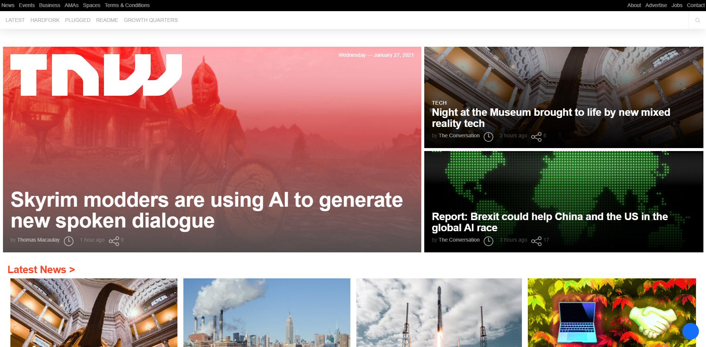
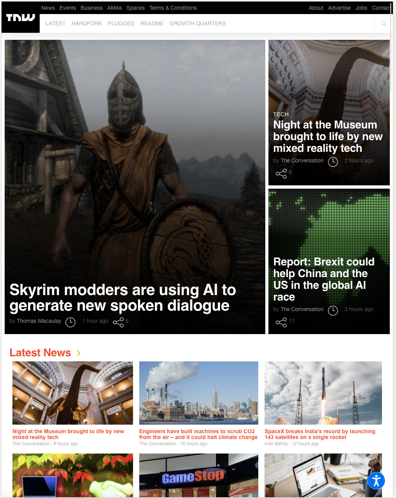

# Project 2: Building with responsive design.

> This project is a clone of the [The Next Web (TNW)](https://thenextweb.com/)

Building with responsive design.

## Built With

- HTML 5
- CSS

## Live Demo

[Live Demo Link](https://memelopez.github.io/microv-wk2proj/)

## Getting Started

**This is an example of how you may give instructions on setting up your project locally.**
**Modify this file to match your project, remove sections that don't apply. For example: delete the testing section if the currect project doesn't require testing.**

To get a local copy up and running follow these simple example steps.

## Getting Started

To get a local copy up and running follow these simple example steps.

### Prerequisites

Have a compatible web browser that supports HTML5 and CSS3 in order to correctly display the website.
A text editor in order to view and edit code. Popular text editors include VSCode and Notepad++.

Most Operative Systems have the .html file extension associated to open with your default web browser. In order to review the code, you may use your web browser inspect element option or open directly with a text editor.

### Usage

git clone git@github.com:memelopez/microv-wk2proj.git

## Authors

👤 **Elmer Lopez**

- GitHub: [@memelopez](https://github.com/memelopez)
- Twitter: [@memelopez10](https://twitter.com/memelopez10)
- LinkedIn: [LinkedIn](https://www.linkedin.com/in/elmer-lopez-51b187200/)

👤 **Kenny Ortega**

- GitHub: [kensayo](https://github.com/kensayo)
- Twitter: [@kensayo](https://twitter.com/kensayo)
- LinkedIn: [LinkedIn](https://www.linkedin.com/in/kenny-ortega-3580aa33/)

## 🤝 Contributing

Contributions, issues, and feature requests are welcome!

Feel free to check the [issues page](issues/).

## Show your support

Give a ⭐️ if you like this project!

## 📝 License

This project is [MIT](https://opensource.org/licenses/MIT) licensed.
